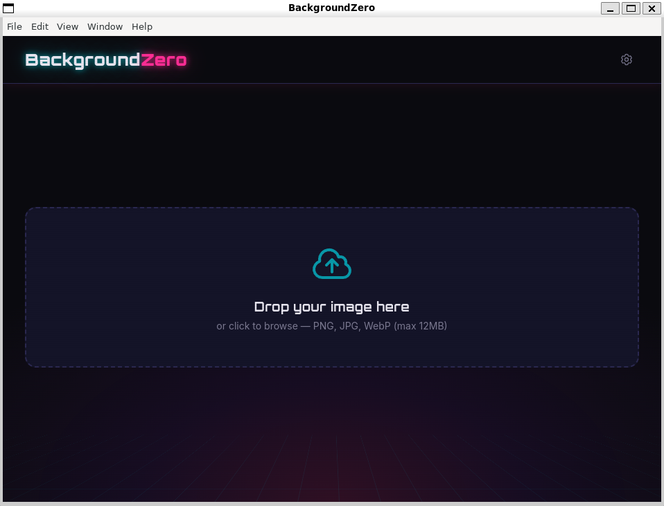

# BackgroundZero

A desktop app for removing image backgrounds. Drop in an image, preview the result side-by-side, and save the processed PNG — all from a clean, minimal interface.

Built with Electron, React, TypeScript, and Tailwind CSS. Ships with two interchangeable background removal engines:

- **remove.bg** — cloud API, fast (~1s/image), high quality, free tier is 50 images/month
- **imgly** — local ML model via [@imgly/background-removal-node](https://github.com/imgly/background-removal-js), runs fully offline, free and unlimited, slower (2–10s/image on CPU)

Choose your engine in Settings. No API key is required when using imgly.



## Features

- **Drag-and-drop or file picker** — supports PNG, JPG, and WebP (up to 12MB)
- **Pluggable engines** — switch between remove.bg (cloud) and imgly (local ML) at any time
- **Side-by-side preview** — compare original and processed images before saving
- **Transparent background** — processed images use a checkerboard preview to show transparency
- **Native save dialog** — export the result as a PNG anywhere on your filesystem
- **Secure by design** — API key is encrypted at rest and never exposed to the renderer process
- **Offline-capable** — imgly engine needs no network after the initial model download
- **Credits tracker** — shows remaining remove.bg API credits when using the cloud engine

## Prerequisites

- **Node.js 22+** (a `.nvmrc` is included)
- **remove.bg API key** — _only required if using the remove.bg engine._ Sign up for free at [remove.bg/api](https://www.remove.bg/api). The free tier includes 50 image processing calls per month.
- **~50MB of disk space** — _only required if using the imgly engine._ The model is downloaded on first use and cached locally.

## Getting Started

```bash
# Clone the repo
git clone https://github.com/ijshd7/backgroundzero.git
cd backgroundzero

# Use the correct Node version
nvm use

# Install dependencies
npm install

# Start the app in development mode
npm run dev
```

On first launch, the app defaults to the remove.bg engine and prompts you for your API key. You can switch to the imgly engine (or update your key) at any time via the settings gear icon in the top-right corner.

### Choosing an engine

| | remove.bg | imgly |
|---|---|---|
| Setup | API key | None |
| Speed | ~1s / image | 2–10s / image (CPU) |
| Network | Required | Only on first run (model download) |
| Quality | Excellent (especially on hair/fur) | Good, weaker on fine detail |
| Cost | 50 images/month free, then paid | Free & unlimited |
| Best for | Product photography, headshots | Privacy-sensitive work, offline use, high volume |

## Scripts

| Command | Description |
|---|---|
| `npm run dev` | Start the app in development mode with hot reload |
| `npm run build` | Build the app for production |
| `npm run preview` | Preview the production build |
| `npm run package` | Build and package the app for distribution |
| `npm run lint` | Type-check the project with TypeScript |

## Project Structure

```
src/
├── main/
│   ├── index.ts            # Electron main process, window creation, IPC handlers
│   └── providers/
│       ├── types.ts        # BackgroundRemovalProvider interface
│       ├── removeBg.ts     # remove.bg cloud API provider
│       ├── imgly.ts        # Local ML provider (lazy-loaded)
│       └── index.ts        # Provider registry and dispatcher
├── preload/
│   └── index.ts            # Context bridge exposing IPC methods to the renderer
└── renderer/
    ├── index.html
    └── src/
        ├── main.tsx         # React entry point
        ├── App.tsx          # Root component, state orchestration
        ├── index.css        # Tailwind imports and custom styles
        ├── components/
        │   ├── DropZone.tsx       # Drag-and-drop image upload area
        │   ├── ImagePreview.tsx   # Side-by-side original vs processed view
        │   ├── SettingsModal.tsx  # Engine picker + API key configuration
        │   └── StatusBar.tsx      # Processing status and error display
        ├── hooks/
        │   └── useImageProcessor.ts  # Image processing state machine
        └── lib/
            └── ipc.ts       # Typed wrapper for the Electron IPC API
```

## How It Works

1. You drop an image onto the app (or click to browse)
2. The renderer reads the file as base64 and sends it to the main process via IPC
3. The main process reads your saved engine choice and dispatches to the matching provider:
   - **remove.bg** — POSTs to the remove.bg API with your encrypted key
   - **imgly** — runs the ONNX model locally on CPU (lazy-loaded on first use)
4. The processed image (transparent PNG) is returned to the renderer as base64
5. Both images are displayed side-by-side for preview
6. Click "Save PNG" to write the result to disk via a native save dialog

### Adding a new engine

Providers conform to the `BackgroundRemovalProvider` interface in [src/main/providers/types.ts](src/main/providers/types.ts). To add an engine, implement a provider, register it in [src/main/providers/index.ts](src/main/providers/index.ts), and add its ID to the `ProviderId` union in both `types.ts` and the preload bridge. The settings UI populates its dropdown from the registry automatically — no UI changes required.

All network and filesystem access happens in the main process. The renderer is sandboxed with `contextIsolation` enabled and `nodeIntegration` disabled.

## License

[MIT](LICENSE)
